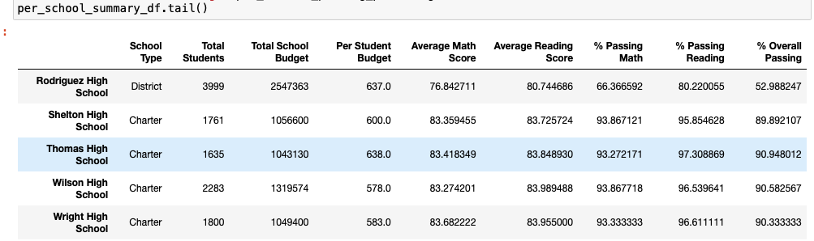
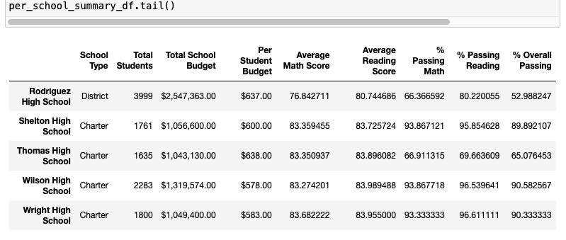

# School_District_Analysis

# Overview - School District Analysis

The purpose of this analysis is to clean the data used during the module. The board has notified that there is evidence of academic dishonesty in the reading and math grades for Thomas High School ninth graders. We will mark these grades as NaN and create a high-level snapshot of the district's key metrics, compare with the results from the module, and present them in a table format. 
The tables presented will include the following:
- Top 5 and bottom 5 performing schools, based on the overall passing rate
- The average math score received by students in each grade level at each school
- The average reading score received by students in each grade level at each school
- School performance based on the budget per student
- School performance based on the school size 
- School performance based on the type of school

# Results

- How is the district summary affected?

The district summary percentages of Passing Math, Passing Reading, and Overall Passing were reduced by less than 1% on average. In my opinion (not expert on school district budgets) it doesn't seem to be that big a difference. 

- How is the school summary affected?

The school summary shows more of a difference but only on the school that had the altered grades (Thomas High School). Again, averages don't show that big of a difference but percentages show a reduction of close to 30% in all three categories.

picture of module

picture of challenge

- How does replacing the ninth graders’ math and reading scores affect Thomas High School’s performance relative to the other schools?

in comparison to other schools, it shows a big difference in the percentages of passing students. This might affect the amount of budget the school gets assigned once the board notices the low averages.

- How does replacing the ninth-grade scores affect the following:
    - Math and reading scores by grade
    The math and reading scores of the fixed table closely resemble the scores with the original altered scores. Replacing the values makes the study more comparable, or allows Thomas High School to stay within the parameters.

    - Scores by school spending
    Results look similar to original data as well. But an interesting thing to note is that  schools that get less budget seem to do better in all grades. 

    - Scores by school size
    Results here are the same as well. But looking at the table, smaller schools seem to do better than bigger ones.

    - Scores by school type
    The results are so similar that only when we have the table without the format we can see and difference in the numbers. Data shows that charter schools do better than District schools by a significant margin.

# Summary

To summarize the difference that changing the 9th graders with NaN values for Thomas High School can be better appreciated in the School Summary DataFrame. 
- Average Reading and Math scores are reduced but not significantly, this happens because NaN will not be counted in the average and the Average changes but not the same if the NaNs were counted as zero.
- Percent passing math and reading numbers decrease significantly (close to 30%) because the number of students stays the same but now one whole grade is valued NaN so it will not be > than 70. This causes the percent to drop.
- Overall passing percent is affected significantly in a similar manner to Math and Reading Percentages, the number of students stays the same but NaN is a non-passing grade.
- Keeping the NaN values make Thomas High School go to the bottom 5 schools in this study, but if we remove the values for 9th graders completely Thomas High School goes to the top of the list.

Keeping or removing NaN values affects data in important ways, it is always good to consider the changes it will cause to your specific study and if it would be considered "doctoring" data in and of itself. 

